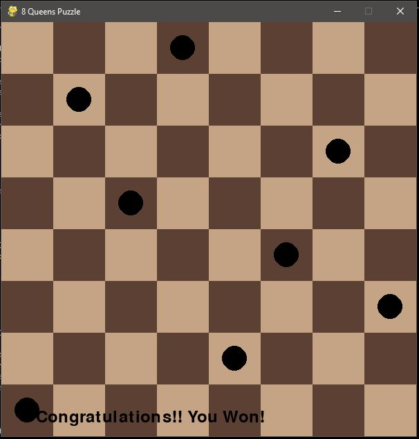
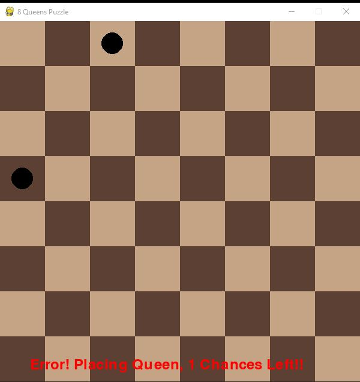
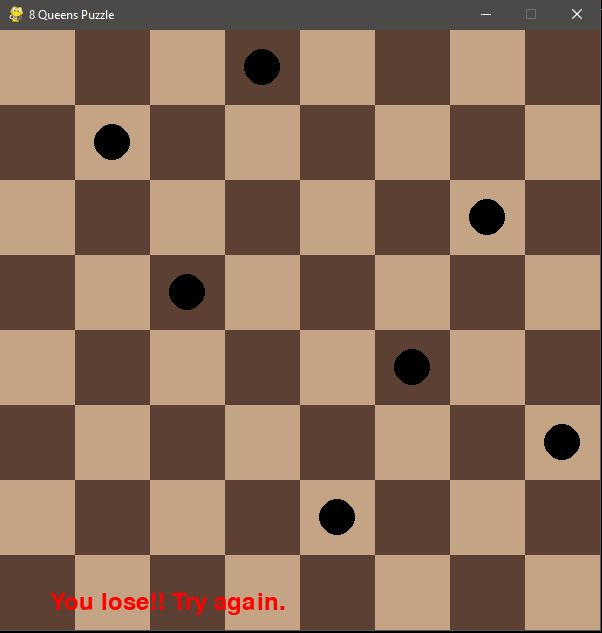

# 8-Queen-Puzzle

This Game project is made on python using **Pygame (GUI Library)**. The concept of game is that player have to place 8-Queens with no attacking queens, **_(A queen will attack another queen if it is placed in either row,column,up-diagonals or down-diagonals)_**, this game is made using **(Constraint Satisfaction Problem)** where the constraints are being defined when a user places it's queen so constraints are defined according to Queen Placement. 

Each Player have 3 chances to make a mistake (If one place in attack of some other queen), once he places 3 wrongly he will **LOSE**, and if he successfully places all 8-Queens he will **WIN** The Game.

# Results
- # Wining Result
    

- # Losing Result
    
    **Here error message represents the remaining chances of player to make an mistake (To Place a queen at attacking posistion)**

    
    **Above is Final Result when a player losses**

## Installation and Run

    1. Clone the repository to your local machine using: 

    https://github.com/sajadali01/8-Queen-Puzzle.git

    2. Install Python Constraint Using **(pip install python-constraint)** then import everything for ease **(from constraint import *)**

    3. Use Google collab for download above things or vs-code, but for vs code use make sure you also have installed with (Jupyter Notebook).

    4. Finally, Run The ipynb file and enjoy playing.....